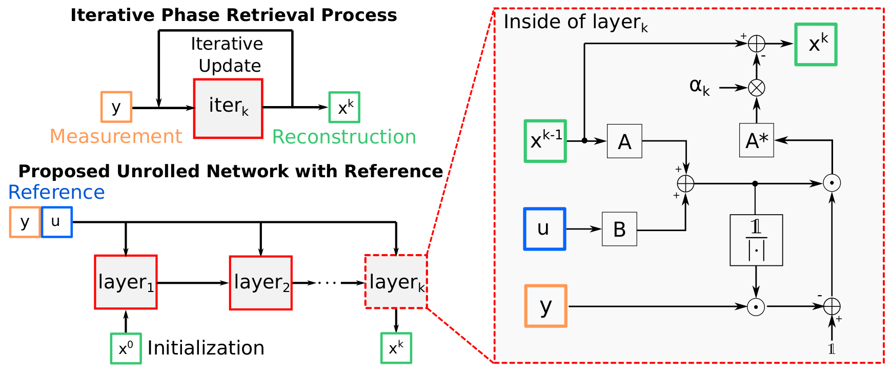

# Solving Phase Retrieval with a Learned Reference (ECCV2020)

This repository is the official implementation of our paper: Solving Phase Retrieval with a Learned Reference

<!--  -->

## Environment

Experiments conducted under:
- python 3.7
- pytorch 1.31

Datasets: `dataset.py`

## Training

To learn the reference, open Jupyter notebook: `Train_abs.ipynb`

> 📋 Some parameters: 
>- the number of iterations (n_steps)
>- the number of training epochs (n_epoch)
>- training samples (n_train)
>- batchsize (n_batch)
>- stepszie (alpha)
>- learning rate (lr_u)

## Evaluation

To evaluate the learned reference on different datasets, run: `Test_mismatch.ipynb`

> 📋 This code includes transformed test images.
